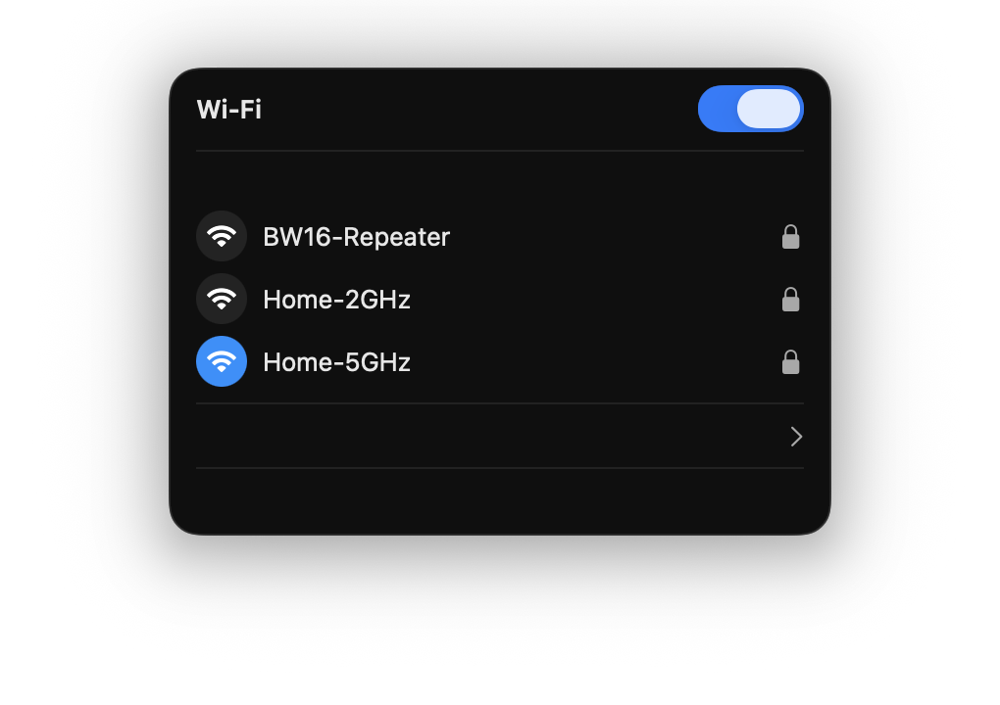
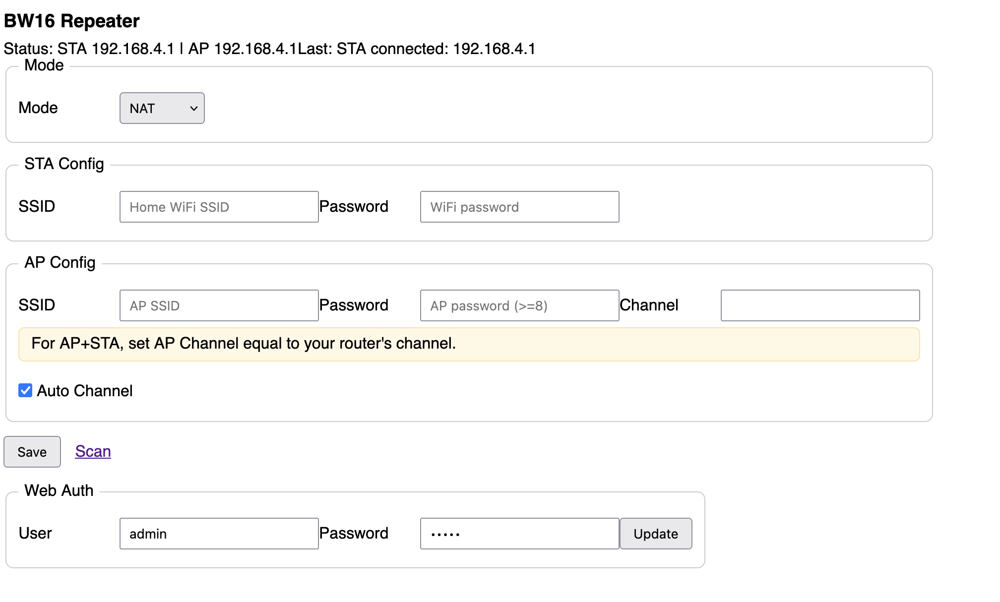

<p align="center">
  
  <br>
  
</p>

<p align="center">
  <a href="https://www.amebaiot.com/en/amebad-bw16/"></a>
  <a href="LICENSE"></a>
</p>

## About
- Full‑featured Wi‑Fi repeater for BW16 (RTL8720DN) on Arduino AmebaD SDK
- Modes: bridge (transparent, proxy‑ARP) and NAT (best‑effort)
- Concurrent STA+AP, prefer 5 GHz with fallback to 2.4 GHz
- BLE configurator and embedded Web UI with authentication

## Repository Structure
```
src/
  wifi_manager/
  nat_manager/
  dhcp_server/
  ble_config/
  webui/
  logger/
  utils/
  main.ino
docs/
scripts/
.github/workflows/
```

## Build on macOS
- See `docs/build-macos.md`

## Flashing
- See `docs/flash.md`

## Management Interfaces
- BLE: service `0xFFF0`, characteristics `0xFFF1..0xFFF6`
- Web UI: `http://<AP IP>/`, Basic auth, user `admin`, password `admin`

### Default Credentials
- AP SSID: `BW16-Repeater`
- AP password: `bw16pass`
- Web UI user: `admin`
- Web UI password: `admin`

### Web UI Endpoints
- `GET /` — status page (STA and AP IPs) + forms
- `POST /config` — set `mode` (`NAT` or `BRIDGE`), `ssid`, `pass` for STA
- `POST /auth` — set Web UI `user`, `pass`

### Setup Guide
- Mode: use `NAT` for typical Internet access; `BRIDGE` is advanced.
- STA Config:
  - `SSID` — your home Wi‑Fi. Prefer 2.4 GHz for first setup.
  - `Password` — your home Wi‑Fi password.
- AP Config:
  - `SSID` — BW16 hotspot name (default `BW16‑Repeater`).
  - `Password` — at least 8 chars; empty enables open AP for diagnostics.
  - `Channel` — must equal STA network channel when using AP+STA (AmebaD limitation).
    - 2.4 GHz: typical channels `1/6/11`.
    - 5 GHz: use non‑DFS channels `36/40/44/48`. DFS (e.g., `52+`, `108`) are not supported.
- Web Auth: set your own user/password for the Web UI.

### How to Find Your Router Channel (macOS)
- Hold Option (⌥)
- Click the Wi-Fi icon in the menu bar
- Look for: Channel: 6 (or whatever)

### Live Logs and Monitoring
- Serial monitor: `arduino-cli monitor --port /dev/tty.usbserial-10 --config baudrate=115200`
- Expect: `BW16‑Repeater started`, `AP start 3` for successful AP start.

### Important Notes for BW16 (AmebaD)
- AP+STA requires the AP channel to match the STA channel; otherwise AP may not be visible.
- DFS channels on 5 GHz (e.g., `108`) are typically not supported; fix your router to a non‑DFS channel (36/40/44/48).
- If STA `SSID` is empty, STA will be skipped to keep AP stable.
- Configuration changes apply immediately: AP restarts only if AP settings changed; STA restarts only if SSID/password changed.
- Security: use `WPA2‑Personal` (PSK). `WPA3‑only` networks may fail to connect on RTL8720DN.
- Region channels: some countries allow 2.4 GHz channels `12/13`. Auto Channel supports extended rotation `1/6/11/13/3/9` to improve matching.
- KM4 (ARM Cortex‑M4): application core used by AmebaD. Flash with `realtek:AmebaD:Ai‑Thinker_BW16` and, if needed, use Burn+RST buttons during upload.

### Troubleshooting AP visibility
- Power cycle BW16 and wait up to 30s for AP
- Ensure AP password length ≥ 8 characters
- Re‑flash with correct FQBN: `realtek:AmebaD:Ai-Thinker_BW16`
- If still not visible, set SSID/password via BLE and reboot
- For 5 GHz, avoid `Auto` channel if it picks DFS; set a fixed non‑DFS channel.
If AP appears briefly then disappears, ensure STA connects successfully and the AP channel matches the router channel.

## Limitations & Modes
- See `docs/limitations.md` and `docs/bridge-vs-nat.md`

## Test Plan
- See `docs/test-plan.md`